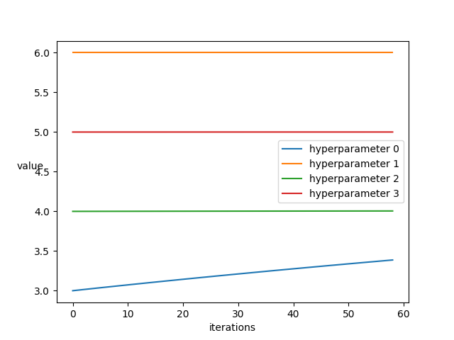
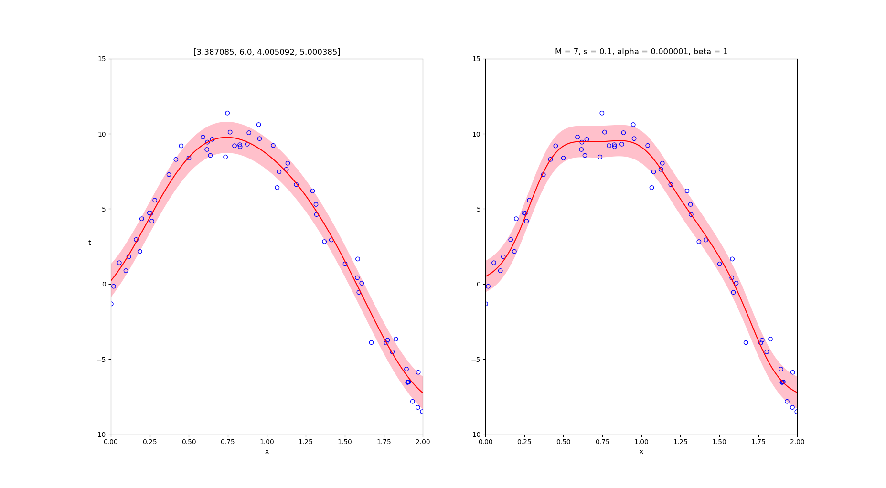

# Homework 3 for Machine Learning

## Environment

* ubuntu 16.04 LTS
* python2.7.12 (using Pycharm 2017.3)
* extra modules: numpy, scipy, pandas, sklearn, matplotlib, prettytable

## Usage of each file

### Gussian Process for Regression (task 1-1)

The file [gaussian_process](gaussian_process.py) will display four gaussian process regression curve 
using different parameters combination with exponential-quadratic kernel, and their RMS error.


```
+----------------+---------------+---------------+
|   parameters   |  train error  |   test error  |
+----------------+---------------+---------------+
|  {1, 4, 0, 0}  | 1.05224307499 | 1.29879575822 |
|  {0, 0, 0, 1}  | 6.65758954447 | 6.74853909467 |
|  {1, 4, 0, 5}  | 1.02884040382 |  1.2860902333 |
| {1, 64, 10, 0} | 1.03287726411 | 1.37490152336 |
+----------------+---------------+---------------+
```

### Automatic relevance deetermination (task 1-2)

The file [ARD_gaussian_process](ARD_gaussian_process.py) will display the parameters updating curve using ARD 
and the regression result using the optimal value compare to bayesian in the previous homework.




```
For ARD gaussian process
+-------------------------------------+----------------+---------------+
|          optimal parameters         |  train error   |   test error  |
+-------------------------------------+----------------+---------------+
| {8.191281, 6.0, 4.010115, 4.945692} | 0.804420485542 | 1.10355040593 |
+-------------------------------------+----------------+---------------+
For bayesian linear regression
+----------------+---------------+
|  train error   |   test error  |
+----------------+---------------+
| 0.838483185841 | 1.15444532053 |
+----------------+---------------+
```

### Support Vector Machine (task 2)

The file [svm](svm.py) will plot four differnet svm decision boundary using iris data set, which are

* linear kernel with first two attribute
* polynomial kernel (degree 2) with first two attribute
* linear kernel with two-dimensional LDA
* polynomial kernel (degree 2) with two-dimensional LDA


### Gaussian Mixture Model (task 3)

The file [kmeans_gmm](k-means_GMM.py) will first compute k (user defined) mean values of the input image 
and output the same image except the pixel values are scale to the nearest mean. 
Then, using these means as initial value for GMM, after perform EM algorithm, output the image 
scale to the most probable mean value.

origin image


k-means(k = 3)


GMM(k = 3)


It will also output the RGB value of the mean, like the following:

```
26 iterations for k = 3
Time cost : 0:00:03
+--------------------+-----+-----+-----+
| k-means mean value |  r  |  g  |  b  |
+--------------------+-----+-----+-----+
|         0          | 191 | 136 |  48 |
|         1          |  51 |  34 |  9  |
|         2          | 208 | 201 | 176 |
+--------------------+-----+-----+-----+
EM finished, time cost : 0:00:39
+----------------+-----+-----+-----+
| GMM mean value |  r  |  g  |  b  |
+----------------+-----+-----+-----+
|       0        | 149 |  98 |  24 |
|       1        |  27 |  18 |  1  |
|       2        | 190 | 180 | 148 |
+----------------+-----+-----+-----+
```